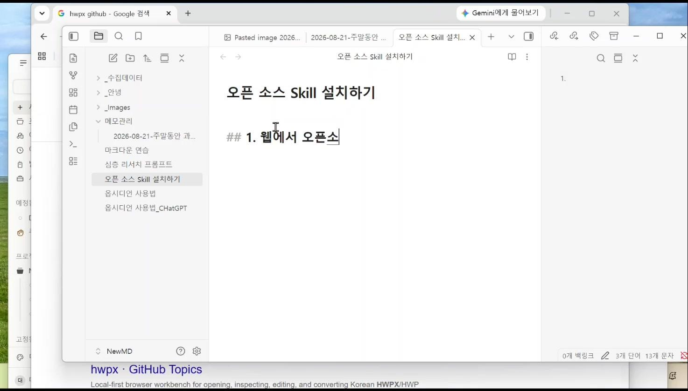
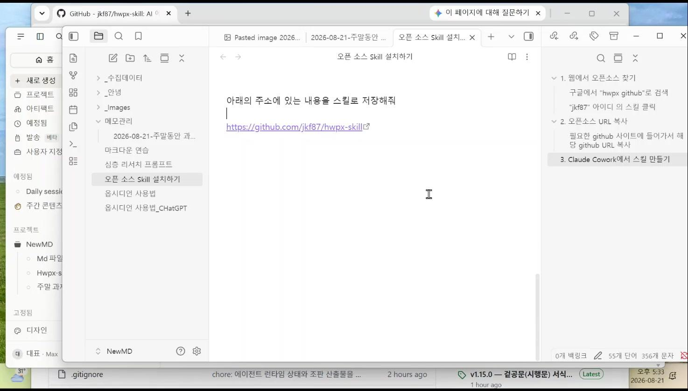
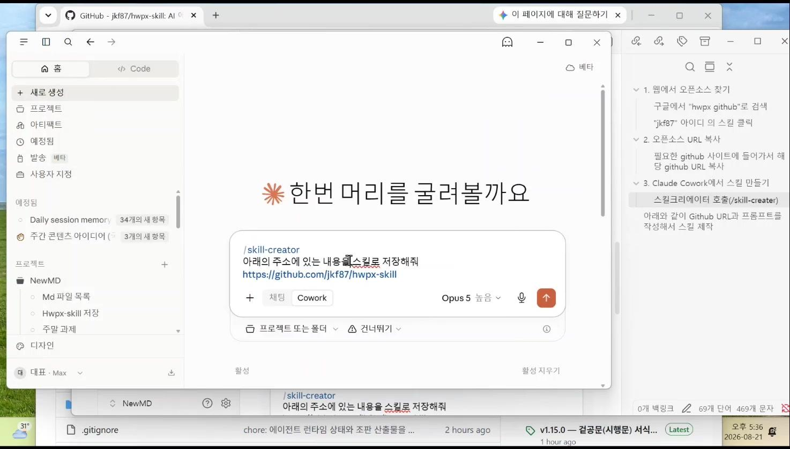
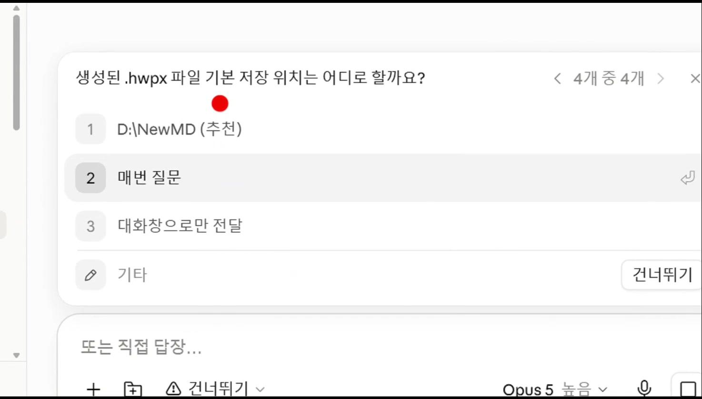
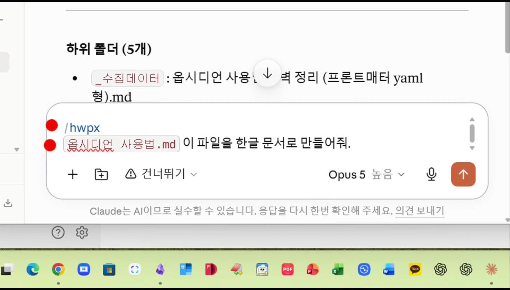

# 클로드(Claude) 스킬(Skill) 만들기
### — 오픈소스 스킬을 가져와 나만의 문서 자동화 도구 만들기 —

> 2026. 8. 21. 순천대학교 생성형AI 전문강사 양성과정 특강 실습 정리
> 시니어를 위한 따라하기 안내서

---

## 0. 이 강의, 한마디로 정리하면

클로드(Claude)에게 「스킬(Skill)」이라는 것을 한 번 만들어 두면, 매번 길게 설명하지 않아도 슬래시(`/`) 명령어 하나로 원하는 작업(예: 한글 문서 만들기)을 시킬 수 있습니다.

이 스킬을 처음부터 직접 만들 필요는 없습니다. 다른 사람이 이미 만들어서 인터넷(깃허브)에 무료로 공개해 둔 것을 찾아 가져오는 방법을 오늘 배웁니다.

**전체 흐름은 딱 세 덩어리입니다.**

1. 웹에서 원하는 스킬을 찾는다
2. 그 스킬이 있는 인터넷 주소(URL)를 복사한다
3. 클로드에게 그 주소를 주고 "스킬로 만들어 줘"라고 시킨다

---

## 1. 시작하기 전에 알아둘 용어 3가지

- **스킬(Skill)**: 미리 적어 둔 '일하는 순서 설명서'입니다. 한 번 만들어 두면 슬래시(`/`) + 이름만 입력해도 그 설명서대로 클로드가 알아서 움직입니다.
- **깃허브(GitHub)**: 전 세계 개발자들이 자신이 만든 프로그램이나 설명서(스킬)를 무료로 올려서 나눠 주는 인터넷 창고입니다.
- **클로드 코워크(Claude Cowork)**: 클로드 데스크톱 앱에서 파일을 함께 다루며 작업해 주는 기능(모드)입니다.

---

## 2. [1단계] 웹에서 원하는 스킬 찾기

1. 인터넷 브라우저(크롬 등)를 열고 구글(Google)에 접속합니다.
2. 검색창에 「원하는 기능 + github」 형식으로 입력합니다.

```
예시 검색어 :  hwpx github
(한글 HWPX 문서를 자동으로 만들어 주는 스킬을 찾는 경우)
```

3. 검색 결과 중 관련된 저장소(예: jkf87 님이 만든 hwpx-skill)를 찾아 클릭합니다.


*실습 화면 – 오른쪽 노트에 "1. 웹에서 오픈소스 찾기" 순서를 정리하며 구글에서 "hwpx github" 검색*

> [!tip] 시니어 팁
> - 검색어에 정답은 없습니다. "한글 문서 만들기 github"처럼 편하게 풀어 써도 됩니다.
> - 검색 결과가 많아 헷갈리면, 제목에 원하는 단어(예: hwpx)가 들어간 것을 먼저 클릭해 보세요.

---

## 3. [2단계] 깃허브 주소(URL) 복사하기

1. 원하는 저장소 페이지로 들어가면, 화면 맨 위 주소창에 인터넷 주소(URL)가 보입니다.

```
예시 주소 :  https://github.com/jkf87/hwpx-skill
```

2. 이 주소를 마우스로 클릭 → 전체 선택 → 복사(Ctrl+C) 합니다.
3. 이 주소가 바로 "스킬의 설계도가 들어 있는 위치"입니다. 잊어버리지 않도록 메모장이나 노트에 붙여 두면 좋습니다.


*실습 화면 – 찾은 저장소 주소를 노트에 붙여넣고, 오른쪽에는 지금까지의 진행 순서가 정리되어 있음*

---

## 4. [3단계] 클로드에게 "스킬로 만들어줘" 시키기

1. 클로드 데스크톱 앱을 열고 새 대화를 시작한 뒤, 화면 아래 모드에서 「Cowork」를 선택합니다.
2. 대화 입력창에 아래 내용을 그대로 입력합니다.

```
/skill-creator
아래의 주소에 있는 내용을 스킬로 저장해줘
https://github.com/jkf87/hwpx-skill
```

3. 입력을 마쳤으면 전송(오른쪽 위쪽 화살표) 버튼을 누릅니다.


*실습 화면 – Cowork 모드에서 /skill-creator 명령과 깃허브 주소를 입력한 모습*

4. 클로드가 스킬을 만드는 동안, 몇 가지를 직접 물어봅니다. 당황하지 말고 화면에 나온 보기 중 하나를 클릭하면 됩니다.

```
질문 예시 :  생성된 .hwpx 파일 기본 저장 위치는 어디로 할까요?
①  D:\NewMD (추천)   ②  매번 질문   ③  대화창으로만 전달
```


*실습 화면 – 클로드가 스킬 제작 중 저장 위치를 묻는 질문 (추천 항목을 선택하면 무난함)*

> [!tip] 시니어 팁
> - 이런 질문에는 정해진 정답이 없습니다. '추천'이라고 표시된 항목을 고르면 대부분 안전합니다.
> - 질문이 여러 개 나와도 하나씩 순서대로 답하면 됩니다. 화면 위쪽에 "4개 중 4개"처럼 진행 상황이 표시됩니다.

모든 질문에 답하고 나면, 클로드가 "저장소를 복사해 왔고 스킬로 정리했습니다"라고 안내합니다. 여기까지 하면 스킬 설치가 끝난 것입니다.

---

## 5. 완성된 스킬 사용해보기

1. 새 대화창에 슬래시(`/`)와 스킬 이름을 입력합니다. (예: `/hwpx`)
2. 변환하고 싶은 파일을 대화창에 끌어다 놓거나 첨부(+) 버튼으로 첨부합니다.
3. 무엇을 해달라는 것인지 짧게 문장으로 적습니다.

```
/hwpx
옵시디언 사용법.md
이 파일을 한글 문서로 만들어줘.
```


*실습 화면 – /hwpx 스킬을 불러와 메모 파일을 한글(hwpx) 문서로 변환 요청*

잠시 기다리면, 앞서 정해 둔 저장 위치(예: D:\NewMD)에 완성된 한글 문서 파일이 자동으로 만들어집니다.

---

## 6. 응용 – 나만의 맞춤 스킬 만들기

이미 만든 기본 스킬(예: `/hwpx`)을 바탕으로, 더 구체적인 용도의 스킬도 새로 만들 수 있습니다. 예를 들어 "공공기관 보고서 서식"에 딱 맞춘 전용 스킬을 만들고 싶다면 아래처럼 요청합니다.

```
/skill-creator
/hwpx 이 스킬을 사용해서 /hwpx-gov 스킬을 만들어줘.
이 스킬은 공공기관 보고서 양식 파일을 사용해서
한글 문서가 만들어지게 해줘.
이 문서의 디자인과 스타일에 내용이 적절하게
들어갈 수 있게 해줘.
```

이렇게 하면 정해진 서식(양식)에 맞추어 자동으로 문서를 채워 주는, 나만의 전용 스킬(`/hwpx-gov`)이 새로 생깁니다. 강의명, 보고서명 등 원하는 서식이 있다면 같은 방식으로 얼마든지 응용할 수 있습니다.

---

## 7. 오늘 배운 내용 한눈에 정리

| 단계 | 하는 일 | 핵심 동작 |
|---|---|---|
| 1 | 웹에서 찾기 | 구글에 "원하는기능 + github" 검색 |
| 2 | 주소 복사 | 저장소 페이지의 인터넷 주소(URL) 복사 |
| 3 | 스킬 만들기 | Cowork에서 /skill-creator + 문장 + 주소 입력 |
| 4 | 사용하기 | 슬래시(/) + 스킬 이름으로 실행, 파일 첨부 후 요청 |
| 5 | 응용하기 | 기존 스킬을 바탕으로 /skill-creator 로 맞춤 스킬 추가 제작 |

### 시니어를 위한 실전 팁

- 처음에는 예시 문장을 그대로 따라 입력해 보고, 익숙해지면 나에게 맞게 문장을 바꿔 보세요.
- 클로드가 물어보는 질문에는 정해진 정답이 없습니다. '추천' 표시가 있는 항목을 고르면 대부분 안전합니다.
- 오타가 나거나 문장이 조금 어색해도 괜찮습니다. 클로드는 대략적인 의미를 알아서 이해합니다.
- 한 번 만든 스킬은 따로 지우지 않는 한 계속 남아 있어, 다음에도 슬래시(/)만 입력하면 바로 쓸 수 있습니다.
- 화면에서 무슨 일이 일어나는지 잘 모르겠으면, 그대로 "지금 무엇을 하고 있는지 쉽게 설명해줘"라고 클로드에게 물어보세요.

---

*정리 : 세이스강(이윤재) · 자료 출처 : 2026.8.21 순천대학교 생성형AI 전문강사 양성과정 실습 영상*
